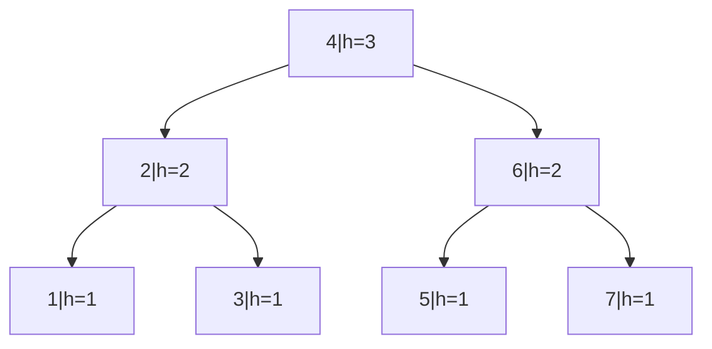
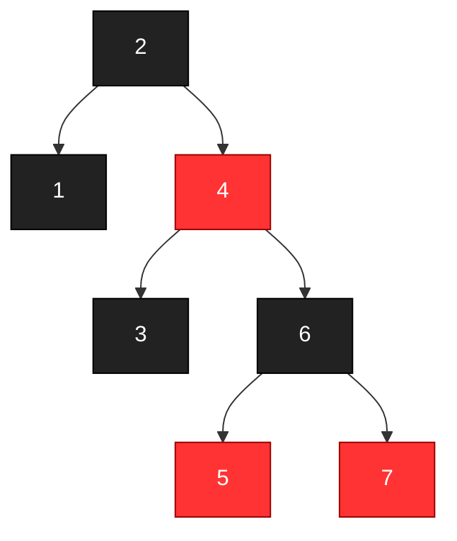
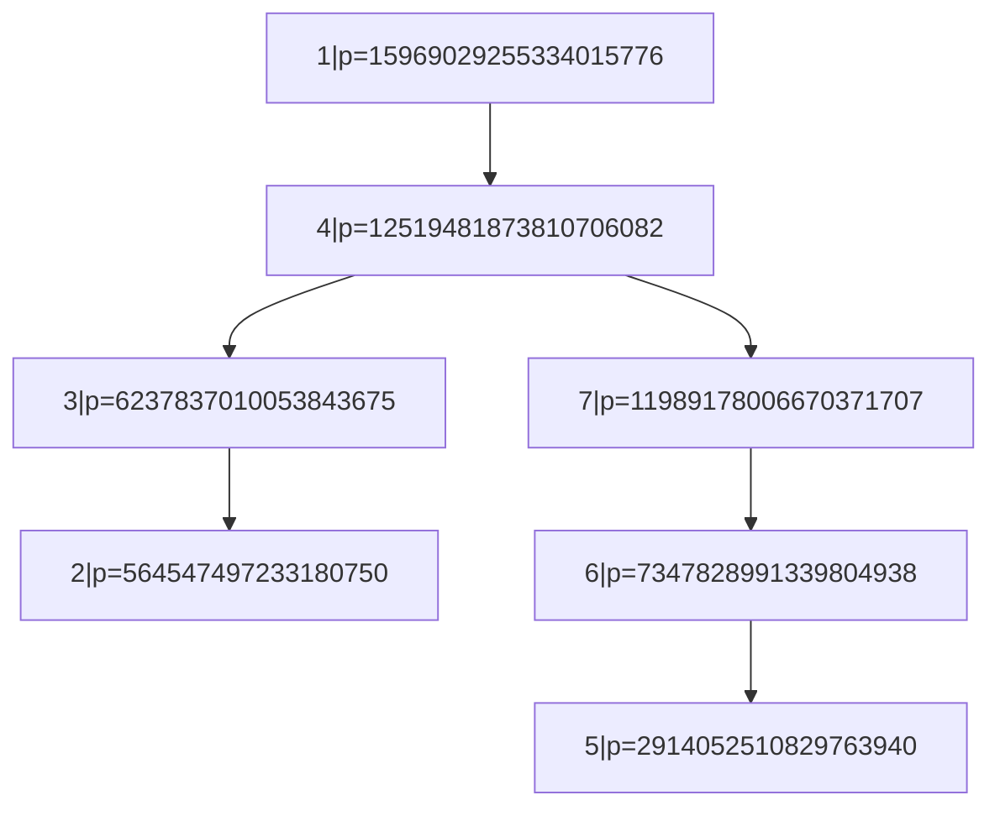
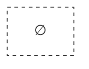

```mermaid
flowchart TD
2734504735424["4|h=3"]
2734504735424 --> 2734504735152
2734504735424 --> 2734504735696
2734504735152["2|h=2"]
2734504735152 --> 2734504735016
2734504735152 --> 2734504735288
2734504735016["1|h=1"]
2734504735288["3|h=1"]
2734504735696["6|h=2"]
2734504735696 --> 2734504735560
2734504735696 --> 2734504735832
2734504735560["5|h=1"]
2734504735832["7|h=1"]
```

--------------------

```mermaid
flowchart TD
classDef red fill:#ff3333,stroke:#990000,color:#ffffff
classDef black fill:#222222,stroke:#000000,color:#ffffff
2734504735184["2"]:::black
2734504735184 --> 2734504735048
2734504735184 --> 2734504735456
2734504735048["1"]:::black
2734504735456["4"]:::red
2734504735456 --> 2734504735320
2734504735456 --> 2734504735728
2734504735320["3"]:::black
2734504735728["6"]:::black
2734504735728 --> 2734504735592
2734504735728 --> 2734504735864
2734504735592["5"]:::red
2734504735864["7"]:::red
```

--------------------

```mermaid
flowchart TD
2734504735080["1|p=15969029255334015776"]
2734504735080 --> 2734504735488
2734504735488["4|p=12519481873810706082"]
2734504735488 --> 2734504735352
2734504735488 --> 2734504735896
2734504735352["3|p=6237837010053843675"]
2734504735352 --> 2734504735216
2734504735216["2|p=564547497233180750"]
2734504735896["7|p=11989178006670371707"]
2734504735896 --> 2734504735760
2734504735760["6|p=7347828991339804938"]
2734504735760 --> 2734504735624
2734504735624["5|p=2914052510829763940"]
```

--------------------

```mermaid
flowchart TD
    classDef nil fill:#fff,stroke:#333,stroke-dasharray:4 4
    N[∅]:::nil
```

--------------------

```mermaid
flowchart TD
    classDef nil fill:#fff,stroke:#333,stroke-dasharray:4 4
    N[∅]:::nil
```

--------------------

```mermaid
flowchart TD
    classDef nil fill:#fff,stroke:#333,stroke-dasharray:4 4
    N[∅]:::nil
```

--------------------

