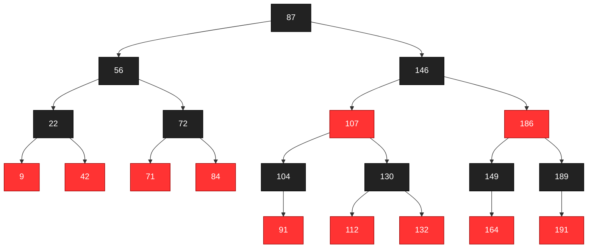

```mermaid
flowchart TD
classDef red fill:#ff3333,stroke:#990000,color:#ffffff
classDef black fill:#222222,stroke:#000000,color:#ffffff
2699047686304["87"]:::black
2699047686304 --> 2699047686720
2699047686304 --> 2699047686096
2699047686720["56"]:::black
2699047686720 --> 2699047687552
2699047686720 --> 2699047687032
2699047687552["22"]:::black
2699047687552 --> 2699047687344
2699047687552 --> 2699047686616
2699047687344["9"]:::red
2699047686616["42"]:::red
2699047687032["72"]:::black
2699047687032 --> 2699047687240
2699047687032 --> 2699047685992
2699047687240["71"]:::red
2699047685992["84"]:::red
2699047686096["146"]:::black
2699047686096 --> 2699047686512
2699047686096 --> 2699047686408
2699047686512["107"]:::red
2699047686512 --> 2699047687448
2699047686512 --> 2699047687656
2699047687448["104"]:::black
2699047687448 --> 2699047687760
2699047687760["91"]:::red
2699047687656["130"]:::black
2699047687656 --> 2699047687864
2699047687656 --> 2699047686928
2699047687864["112"]:::red
2699047686928["132"]:::red
2699047686408["186"]:::red
2699047686408 --> 2699047686824
2699047686408 --> 2699047686200
2699047686824["149"]:::black
2699047686824 --> 2699047687136
2699047687136["164"]:::red
2699047686200["189"]:::black
2699047686200 --> 2699047687968
2699047687968["191"]:::red
```