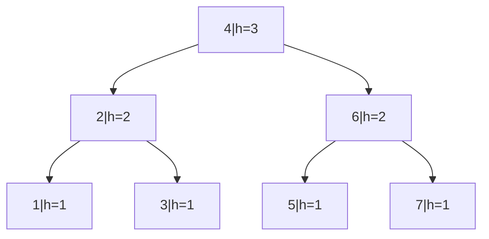
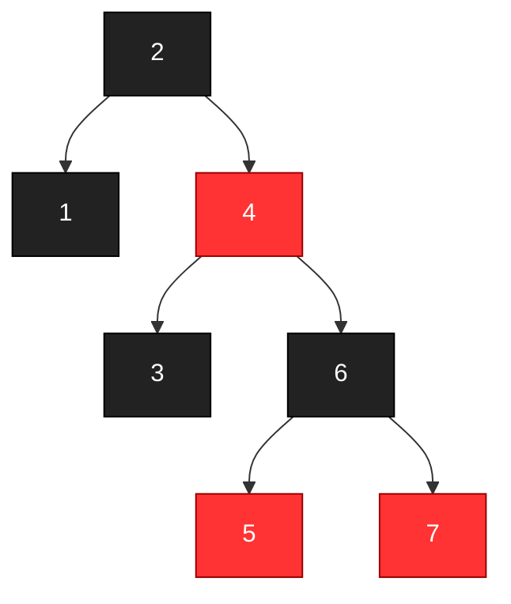
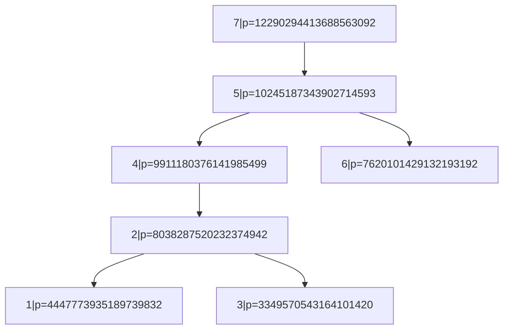
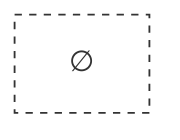

```mermaid
flowchart TD
2999937462608["4|h=3"]
2999937462608 --> 2999937462336
2999937462608 --> 2999937462880
2999937462336["2|h=2"]
2999937462336 --> 2999937462200
2999937462336 --> 2999937462472
2999937462200["1|h=1"]
2999937462472["3|h=1"]
2999937462880["6|h=2"]
2999937462880 --> 2999937462744
2999937462880 --> 2999937463016
2999937462744["5|h=1"]
2999937463016["7|h=1"]
```

--------------------

```mermaid
flowchart TD
classDef red fill:#ff3333,stroke:#990000,color:#ffffff
classDef black fill:#222222,stroke:#000000,color:#ffffff
2999937462368["2"]:::black
2999937462368 --> 2999937462232
2999937462368 --> 2999937462640
2999937462232["1"]:::black
2999937462640["4"]:::red
2999937462640 --> 2999937462504
2999937462640 --> 2999937462912
2999937462504["3"]:::black
2999937462912["6"]:::black
2999937462912 --> 2999937462776
2999937462912 --> 2999937463048
2999937462776["5"]:::red
2999937463048["7"]:::red
```

--------------------

```mermaid
flowchart TD
2999937463080["7|p=12290294413688563092"]
2999937463080 --> 2999937462808
2999937462808["5|p=10245187343902714593"]
2999937462808 --> 2999937462672
2999937462808 --> 2999937462944
2999937462672["4|p=9911180376141985499"]
2999937462672 --> 2999937462400
2999937462400["2|p=8038287520232374942"]
2999937462400 --> 2999937462264
2999937462400 --> 2999937462536
2999937462264["1|p=4447773935189739832"]
2999937462536["3|p=3349570543164101420"]
2999937462944["6|p=7620101429132193192"]
```

--------------------

```mermaid
flowchart TD
    classDef nil fill:#fff,stroke:#333,stroke-dasharray:4 4
    N[∅]:::nil
```

--------------------

```mermaid
flowchart TD
    classDef nil fill:#fff,stroke:#333,stroke-dasharray:4 4
    N[∅]:::nil
```

--------------------

```mermaid
flowchart TD
    classDef nil fill:#fff,stroke:#333,stroke-dasharray:4 4
    N[∅]:::nil
```

--------------------

